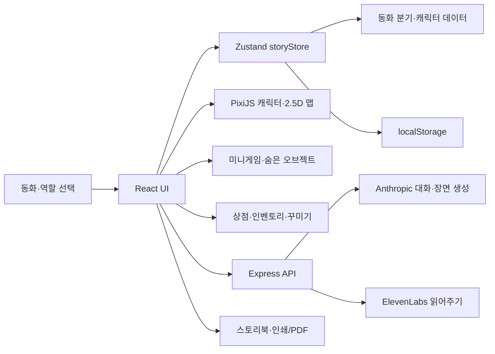

# Once upon a play 구현 및 파이프라인

현재 저장소의 실제 구현을 기준으로 작성한 기능 명세와 개발·배포 안내입니다. 이 프로젝트는 9~12세 어린이가 동화 속 역할을 선택하고, 캐릭터와 대화하고, 다음 장면을 만들며 맵 탐색·미니게임·꾸미기를 즐기는 React 웹 게임입니다.

## 현재 서비스

- 프로덕션: <https://once-upon-a-play.vercel.app>
- 플레이 가능한 동화: **The Path Through the Grey Wood**
- 역할: **Red**, **Gray the wolf**, **Visitor**
- 기술: React 19, TypeScript, Vite, Zustand, PixiJS, Express, Anthropic Claude, ElevenLabs
- 저장: 브라우저 `localStorage`. 로그인과 서버 데이터베이스는 없습니다.

## 전체 구조



## 사용자 경험

1. **동화와 역할 선택:** `MapSelect`에서 동화와 역할을 선택하고 저장 기록을 이어서 플레이할 수 있습니다. Red/Gray의 이름표는 `Me: 이름`, Visitor는 `Me`로 표시합니다.
2. **준비된 이야기 분기:** 선택지는 플래그와 다음 장면을 변경합니다. 역할, 이전 선택, 동료 구성에 따라 내레이션과 등장인물이 달라집니다.
3. **캐릭터 대화:** 캐릭터 선택 후 문장을 보내면 `/api/chat`이 현재 장면·최근 기록·동료 정보를 바탕으로 캐릭터 답변과 최대 3개 후속 문구를 만듭니다. 사용자 말과 답변은 맵의 말풍선에도 표시됩니다.
4. **직접 다음 장면 만들기:** 최대 300자의 아이디어를 `/api/imagine`에 보내 제목, 내레이션, 배경, 소품, 캐릭터 배치·동작, 선택지와 이야기 상태를 생성합니다. 성공할 때마다 **3코인**을 지급합니다. 추천 행동을 선택하거나 직접 계속 입력할 수 있고 결말 생성도 지원합니다.
5. **맵 조작:** 캐릭터와 항상 보이는 이름표를 드래그할 수 있습니다. 위치는 장면별로 저장되고 상점 왕복 후에도 유지됩니다. 넓은 맵은 마우스 휠·트랙패드로 좌우 탐색하며, 생성 맵 소품은 이동·크기 조절·제거할 수 있습니다.
6. **탐색:** 각 맵에 맞는 숨은 오브젝트가 배치됩니다. 숲은 나무·수풀, 우주는 행성·혜성, 연구실은 조명·현미경처럼 배경에 따라 바뀝니다. 타일형 맵에는 이동 가능 타일 사이 검색 지점 두 곳이 숨습니다.
7. **상점:** `🎒 My items`와 `🛍️ Store`에서 소유 아이템과 상점을 엽니다. 플레이어가 상점으로 이동하는 전환 애니메이션 뒤 Story Store가 열리며, Visitor는 일반 입장 연출을 사용합니다.
8. **동료:** 준비된 동료를 초대하거나 카메라·이미지 파일로 투명 PNG 캐릭터를 만들 수 있습니다. 이름·성격·재능·목표를 선택하거나 직접 입력하며 AI의 대화와 행동 추천에 반영됩니다.
9. **읽어주기와 책:** `/api/narrate`가 화자별 ElevenLabs MP3를 생성합니다. 결말에서는 이야기 기록을 책 페이지로 만들고 브라우저 인쇄/PDF 저장을 지원합니다.

## 미니게임과 코인

캐릭터 대화의 게임 버튼 또는 숨은 오브젝트에서 6종 중 하나가 무작위로 시작됩니다. 한 판당 보상은 한 번만 지급됩니다.

| 게임 | 규칙 | 보상 |
| --- | --- | --- |
| Forest pairs | 캐릭터 테마 카드 8장에서 네 쌍 찾기 | 4~14코인 |
| Forest echo | 4개 기호 순서를 길이 3부터 4·5·6까지 기억 | 5~16코인 |
| Odd leaf out | 3×3에서 다른 기호 찾기, 5라운드 | 3~16코인 |
| Stepping stones | 섞인 숫자 1~10을 순서대로 선택 | 3~16코인 |
| Firefly chase | 15초 동안 이동하는 반딧불 잡기 | 최대 18코인 |
| Forest riddles | 무작위 수수께끼 4개 풀기 | 3~16코인 |

보상 계산:

- 이야기 프롬프트로 장면 생성 성공: **3코인**
- 숨은 오브젝트: 35% 확률로 **3~7코인**, 65% 확률로 무작위 미니게임
- 미니게임: 실수·턴·점수에 따라 차등 지급
- 차단된 입력, 서버 오류, 빈 응답은 이야기 생성 보상을 지급하지 않습니다.
- 같은 장면의 같은 비밀과 같은 게임 완료에는 중복 보상이 없습니다.

## 상점과 꾸미기

### 상점 맵과 화면

- 상점 입장·퇴장 애니메이션과 캐릭터 이동을 제공합니다.
- 기존 이야기 맵 일부와 가로형 상점 맵을 함께 보여줍니다.
- 좌우 3단 진열대 위의 **Map decorations**, **Character accessories** 표지판이나 패널 버튼으로 페이지를 엽니다.
- 플레이어 캐릭터는 가운데 의자 크기에 맞춰 표시되어 진열대를 가리지 않습니다.
- 구매 기록·착용 상태·장식 배치는 `storyStore`에 저장됩니다.

### Map decorations

- 꽃, 버섯, 나비, 반딧불, 구름, 무지개, 연못, 나무, 성, 수정, 별, 눈, 음악, 배, 폭포, 분수, 모닥불, 달, 혜성, 풍선, 보물, 요정 문, 화분, 책, 눈사람 등 **30종**입니다.
- 일부 장식은 떠다니거나 반짝이는 반복 애니메이션이 있습니다.
- 구매 후 모든 장면에서 다시 사용할 수 있고 장면당 최대 30개를 배치합니다.
- 선택한 장식은 드래그로 이동하고 오른쪽 아래 손잡이로 0.5~2.5배 크기를 조절하며 제거할 수 있습니다.
- 장식 밖을 선택하면 편집 손잡이가 사라집니다.

### Character accessories

- 왕관, 모자, 리본, 마술봉, 꽃관, 캡, 안경, 선글라스, 목도리, 목걸이, 가방, 날개, 티아라, 헤드폰, 가면, 메달, 방울, 방패 등 **20종**입니다.
- 캐릭터별로 하나를 착용하거나 제거합니다.
- Dress up 미리보기 아래의 X, Y, Size 조절 막대로 체형에 맞게 위치와 크기를 맞춥니다.
- 맞춤값은 `캐릭터 ID + 아이템 ID`별로 저장되어 상점과 실제 맵에 함께 적용됩니다.
- 구매한 상품은 `My items`에서 언제든 다시 배치하거나 착용할 수 있습니다.

## 캐릭터 시스템

| 구분 | 캐릭터 |
| --- | --- |
| 역할·주요 인물 | Red, Gray, Nana Wren, Visitor |
| 초대 동료 | Moss, Bramble, Lumen, Pebble, Pip, Fern |
| 사용자 제작 | 카메라·이미지에서 만든 복수의 커스텀 캐릭터 |

- 모든 캐릭터는 역할, 성격, 목표, 지식, 금지 행동, 대화 시작 문구와 안전 대체 답변을 가집니다.
- 모든 이름은 클릭 전에도 표시됩니다. 플레이어는 Red/Gray일 때 `Me: 이름`, Visitor일 때 `Me`입니다.
- 캐릭터와 이름표는 함께 이동하며 맵 소품보다 앞에 표시됩니다.
- 동료, 커스텀 캐릭터, 대화, 위치는 상점 방문 후에도 유지됩니다.
- 커스텀 캐릭터는 이름(최대 24자), Personality, 잘하는 것, 하고 싶은 일을 입력합니다. 세 프로필 항목 모두 준비된 선택지와 직접 입력을 지원하며 길이·문자·안전 검사를 거칩니다.
- 투명 PNG와 프로필은 저장되고 Claude에는 명령이 아닌 이야기 사실로 전달됩니다.

## 맵 시스템

장면 생성기가 사용할 수 있는 프리셋 배경은 **36개**입니다.

`steelhacks`, `forest`, `meadow`, `river`, `mountain`, `sky`, `ocean`, `space`, `classroom`, `hackathon`, `castle`, `village`, `cave`, `desert`, `snowfield`, `library`, `kitchen`, `city`, `garden`, `island`, `airship`, `restroom`, `bedroom`, `playground`, `hospital`, `museum`, `cafe`, `trainstation`, `farm`, `beach`, `jungle`, `swamp`, `volcano`, `laboratory`, `theater`, `spaceship`

- 대부분은 HTML/SVG/CSS와 PixiJS로 구현한 2.5D 장면입니다.
- 전경·중경·후경, 그림자, 움직이는 구름과 소품으로 깊이감을 표현합니다.
- AI는 배경과 최대 6개의 프리셋 소품을 조합합니다.
- 캐릭터는 소품과 겹치지 않는 하단 영역에 배치하며 걷기·보기·제스처 동작을 순서대로 재생합니다.
- SteelHacks는 `public/maps/steelhacks-xiii.png`의 공식 네온 Pittsburgh 이미지를 사용합니다.

### SteelHacks·스폰서 키워드 매칭

`src/content/keywordMaps.ts`가 실제 사용자 프롬프트를 검사합니다. 첫 일치 규칙이 AI가 고른 배경보다 우선하며 영어·한국어 표기를 지원합니다.

| 키워드 | 연결 맵 |
| --- | --- |
| SteelHacks, 스틸핵스, hackathon, 해커톤, Pitt/University of Pittsburgh/Pitts Univ, Pitt CSC·SCI, MLH | 공식 SteelHacks XIII Pittsburgh 이미지 |
| Pittsburgh/피츠버그, CMU/Carnegie Mellon, PNC, BNY, SCM, CGI, Marinus Analytics | Pittsburgh 기술 지구 |
| NVIDIA/Nemotron, Anthropic/Claude, Wolfram, LANXESS/Xtract, AI/인공지능 | AI·과학 연구실 |
| ElevenLabs, Out Loud, text to speech, voice agent, dubbing/더빙 | 음성·사운드 스튜디오 |
| UPMC, healthcare, hospital/병원, clinic/의료 | 의료 혁신 센터 |
| Pear VC, Afore Capital, Seed Round, startup/스타트업 | 스타트업 씨앗 정원 |
| Vercel, PostHog, Press Start, Cold Start, No Wrapper, cloud, makerspace | 협업 메이커스페이스 |
| 일반 university, college, campus, student, computer science | 대학교 교실 |

## 상태 저장

`src/state/storyStore.ts`가 다음 상태를 Zustand와 `localStorage`의 `tale-weaver:v1`에 저장합니다.

- 화면, 동화, 장면, 분기 플래그, 이야기 로그
- 캐릭터별 대화, 역할, 동료와 커스텀 캐릭터
- 장면별 캐릭터 위치와 생성 장면
- 코인, 발견한 비밀, 구매 상품
- 장면별 장식, 캐릭터별 액세서리와 맞춤값

상점도 같은 상태를 사용하므로 방문 전후에 캐릭터와 이야기가 유지됩니다. Restart는 저장 키를 삭제합니다.

`src/state/imageCache.ts`의 IndexedDB `tale-weaver-images`는 과거 저장 데이터에 `imageId`가 있을 때 배경을 불러오는 호환 경로입니다. 현재 서버에는 새 AI 배경을 생성하는 `/api/background`가 없습니다.

## 주요 코드

| 기능 | 파일 |
| --- | --- |
| 화면과 전환 | `src/App.tsx` |
| 상태·코인·구매·배치 | `src/state/storyStore.ts`, `types.ts` |
| 동화 분기 | `src/content/tales/` |
| 캐릭터·프로필 | `src/content/characters.ts`, `customProfile.ts` |
| Pixi·맵 | `src/pixi/PixiStage.tsx`, `src/ui/PrebuiltMap.tsx`, `GeneratedMap.tsx` |
| 숨은 탐색 | `src/content/secretScenery.ts` |
| 미니게임 | `MemoryGame.tsx`, `SequenceGame.tsx`, `ExtraGames.tsx` |
| 상점·상품 | `ShopStage.tsx`, `StorePanel.tsx`, `src/content/shopItems.ts` |
| 인벤토리·장식 | `InventoryPanel.tsx`, `MapDecorations.tsx` |
| 그림 캐릭터 | `DrawingScanner.tsx`, `src/pixi/scanDrawing.ts` |
| 키워드 맵 | `src/content/keywordMaps.ts` |
| 대화·안전 | `server/app.ts`, `persona.ts`, `safety.ts` |
| 장면 생성·검증 | `server/imagine.ts`, `scenePlan.ts`, `mapSpec.ts` |
| 음성 | `server/narrate.ts`, `readingScript.ts` |
| 책 | `Storybook.tsx`, `storyPages.ts`, `renderStoryArt.tsx` |

## AI와 외부 서비스

| 서비스 | 용도 | 환경변수 | 실패 시 |
| --- | --- | --- | --- |
| Anthropic Claude, 기본 `claude-haiku-4-5` | 대화와 장면·맵·행동·선택지 생성 | `ANTHROPIC_API_KEY`, 선택적 `ANTHROPIC_MODEL` | 데모 대화·장면 |
| ElevenLabs `eleven_flash_v2_5` | 내레이션과 대사 MP3 | `ELEVENLABS_API_KEY`, 선택적 화자 voice ID | 읽어주기 오류 표시 |

- Claude에는 현재 장면·목표·플래그·최근 이야기와 대화·동료 프로필을 전달합니다.
- 장면 출력은 허용된 배경·소품·캐릭터·좌표·플래그인지 서버에서 검증합니다.
- 현재 코드에는 Replicate와 `/api/background`가 없습니다.

## 안전과 요청 제한

- 이야기 입력 최대 300자, 음성 텍스트 최대 1,800자, JSON 본문 최대 64KB
- 개인정보, 폭력적·부적절한 입력, 프롬프트 조작을 호출 전후에 검사합니다.
- 차단된 대사는 이야기에서 되돌리고 어린이용 안내를 표시하며 Claude 출력과 추천 문구도 재검사합니다.
- IP·서버 인스턴스 기준 시간당 제한: `/api/chat` 30회(Claude 연결 시), `/api/imagine` 30회, `/api/narrate` 20회
- 제한은 인스턴스 메모리에 있으므로 재시작 시 초기화되고 여러 인스턴스에 공유되지 않습니다.

## API

| 엔드포인트 | 역할 |
| --- | --- |
| `GET /api/health` | 서버 상태, Claude live/mock와 모델 |
| `POST /api/chat` | 캐릭터 답변과 추천 문구 |
| `POST /api/imagine` | 새 장면, 맵, 행동, 선택지, 플래그와 이야기 상태 |
| `POST /api/narrate` | 화자별 Base64 MP3 |

Vercel 진입점은 `api/chat.js`, `api/imagine.js`, `api/narrate.js`, `api/health.js`입니다.

## 실행·테스트·배포

Node 요구 버전은 `>=24 <26`입니다.

```bash
npm ci
npm run dev
npm run typecheck
npm test
npm run build
npm start
```

- 개발: Vite `localhost:5173`, Express `localhost:8787`; Vite가 `/api`를 프록시합니다.
- `typecheck`: TypeScript 검사
- `test`: 서버·상태·분기·지도·스캔·스토리북 테스트
- `build`: TypeScript → Vercel용 Express 번들 → Vite 빌드
- `start`: 빌드 클라이언트와 API를 Express로 함께 제공
- `vercel.json`은 Vite 정적 파일과 `api/*.js` 함수를 연결합니다.
- `build:api`는 `server/app.ts`를 `server/vercel-app.js`로 번들합니다.
- 프로덕션 환경에는 Anthropic·ElevenLabs 키가 설정되어 있으며 비밀값은 클라이언트 번들에 포함되지 않습니다.
- 배포 후 `/`, `/api/health`, `/maps/steelhacks-xiii.png`를 확인합니다.

## 현재 범위와 제한

- 여러 동화 카드 중 실제 플레이 가능한 동화는 현재 1개입니다.
- 계정, 클라우드 저장, 서버 DB, 여러 기기 동기화는 없습니다.
- 브라우저 데이터 삭제 또는 Restart 시 로컬 진행 상황이 사라집니다.
- 상품은 이모티콘 기반이며 일부 배경과 캐릭터는 SVG·Pixi 도형입니다.
- 클라이언트 메인 번들은 크기 경고가 있지만 빌드와 실행에는 영향을 주지 않습니다.
