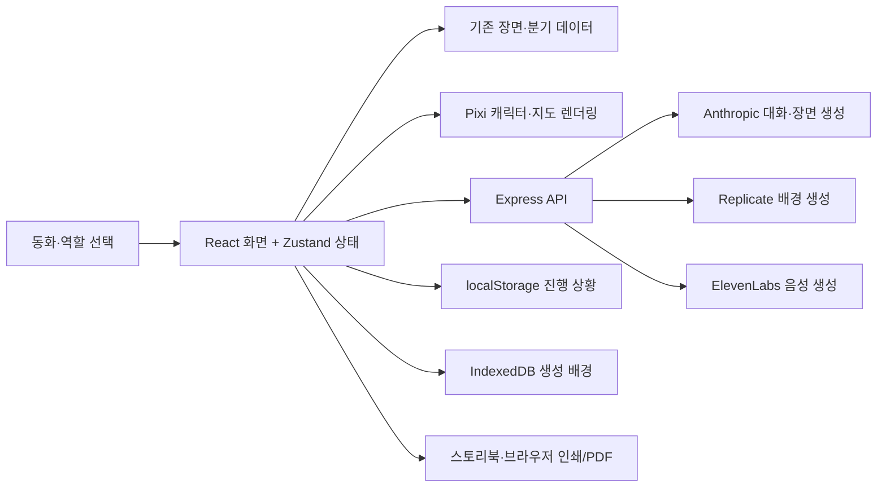

# Once upon a play 웹 파이프라인

현재 저장소의 구현을 기준으로 정리했습니다. 이 프로젝트는 9~12세 어린이가 동화 속 역할을 골라 대화하고, 선택하거나 직접 다음 장면을 만들며, 완성된 이야기를 책으로 저장하는 웹 프로토타입입니다.

## 전체 흐름

## 사용자 경험 순서

1. **동화와 역할 선택:** `MapSelect`에서 현재 플레이 가능한 동화인 *The Path Through the Grey Wood*를 고르고 Red, Gray 또는 방문자 역할을 선택합니다. 기존 저장 기록이 있으면 이어서 플레이할 수 있습니다.
2. **장면 표시:** `storyStore`가 시작 장면과 역할별 문장을 가져옵니다. `App`은 배경·캐릭터를 `PixiStage`에, 내레이션·선택지·대화창을 옆 패널에 표시합니다.
3. **정해진 분기:** 선택지는 동화 데이터에 정의된 효과로 플래그를 바꾸고 다음 장면으로 이동합니다. 다음 장면의 문장과 등장인물은 역할과 플래그에 따라 달라집니다. 대화 중 AI가 제안하는 문구는 대화 입력용이며, 자체적으로 분기나 플래그를 변경하지 않습니다.
4. **캐릭터 대화:** 사용자의 문장과 최근 대화·장면 맥락을 `/api/chat`으로 보냅니다. 서버는 입력을 검사한 후 Anthropic 모델에 캐릭터 역할의 응답을 요청하고, 출력도 검사해 답변과 최대 3개의 제안 문구를 돌려줍니다. API 키가 없거나 모델 호출에 실패하면 미리 작성된 데모 응답을 사용합니다.
5. **새 장면 만들기:** 사용자가 *What happens next?*에 아이디어를 입력하거나 생성 지도에서 출구를 누르면 `/api/imagine`이 장면 문장, 테마, 6×4 타일, 상호작용 물체, 시작점, 출구를 생성합니다. 서버가 형식과 이동 가능한 경로를 검증하고, 유효하지 않은 지도는 기본 배치로 대체합니다. API 키가 없으면 사용자의 아이디어를 담은 데모 장면을 반환합니다.
6. **배경 이미지:** Replicate 토큰이 있으면 장면을 먼저 보여준 뒤 `/api/background`를 별도로 호출합니다. FLUX.1 Schnell이 만든 이미지를 배경에 적용하고 기존 캐릭터와 지도 조작 요소는 그 위에 유지합니다. 실패하면 코드로 그린 SVG 배경을 계속 사용합니다.
7. **캐릭터 추가:** 준비된 동료를 선택하거나 카메라·이미지 파일로 그림을 입력합니다. 그림은 브라우저에서 잘라내고 종이 배경을 제거해 투명 PNG 캐릭터로 만듭니다. 이름·성격·재능·목표를 정하면 현재 이야기의 동료와 대화 상대로 추가됩니다.
8. **읽어주기와 결말:** 듣기 버튼은 `/api/narrate`로 현재 장면 또는 답변의 음성을 요청합니다. 서버는 화자별로 문장을 나누어 ElevenLabs MP3를 생성합니다. 결말에서는 이야기 기록으로 책 페이지와 삽화를 만들고 브라우저 인쇄 기능으로 PDF 저장을 지원합니다.

## 데이터와 요청 경로

| 데이터·기능 | 경로 | 처리 결과 |
| --- | --- | --- |
| 동화 원본·분기 | `src/content/tales/`, `src/content/characters.ts` | 장면, 선택지, 역할별 서술, 캐릭터 설정 |
| 게임 상태 | `src/state/storyStore.ts` | 현재 장면, 플래그, 대화, 동료, 이야기 기록 관리 |
| 대화 | `src/api/chat.ts` → `POST /api/chat` → `server/app.ts` | 안전 검사 → Anthropic 또는 데모 응답 → 출력 검사 |
| 장면 생성 | `POST /api/imagine` → `server/imagine.ts`·`server/mapSpec.ts` | 장면·지도 생성 및 검증 |
| 이미지 생성 | `POST /api/background` → `server/background.ts`·`server/generateBackground.ts` | Replicate 이미지 수신, 실패 시 SVG 유지 |
| 음성 생성 | `POST /api/narrate` → `server/narrate.ts`·`server/readingScript.ts` | 화자별 ElevenLabs 음성 클립 |
| 사용자 그림 | `src/ui/DrawingScanner.tsx` → `src/pixi/scanDrawing.ts` | 브라우저 안에서 투명 PNG 추출 |
| 책 출력 | `src/ui/Storybook.tsx`, `src/ui/storyPages.ts` | 기록을 페이지로 구성하고 `window.print()` 실행 |

진행 상황은 사용자 브라우저의 `localStorage`(`tale-weaver:v1`)에 저장됩니다. 생성된 배경 이미지는 `IndexedDB`(`tale-weaver-images`)에 별도 저장하고, `localStorage`에는 이미지 식별자만 남깁니다. 음성 클립은 열린 페이지 안에서 최대 5개를 재사용합니다. 공용 계정이나 서버 데이터베이스는 없습니다.

## 사용 중인 AI 기술과 외부 API

| 서비스·모델 | 쓰이는 곳 | 서버에서 하는 일 | 인증 설정 | 키가 없거나 실패하면 |
| --- | --- | --- | --- | --- |
| Anthropic Claude (`claude-haiku-4-5` 기본값) | 캐릭터 대화, 사용자 아이디어로 새 장면 생성 | Messages API와 도구 호출로 구조화된 대화·장면 결과를 받음 | `ANTHROPIC_API_KEY`; 모델 변경은 `ANTHROPIC_MODEL` | 대화는 작성된 데모 응답, 새 장면은 단순 데모 장면 |
| Replicate의 `black-forest-labs/flux-schnell` | 새 장면의 삽화 배경 | Predictions API에 배경 프롬프트를 전송하고 결과 이미지를 가져옴 | `REPLICATE_API_TOKEN` | 기존 SVG 배경 사용 |
| ElevenLabs `eleven_flash_v2_5` | 장면·대사 읽어주기 | Text to Speech API로 화자별 MP3 클립 생성 | `ELEVENLABS_API_KEY`; 화자별 음성 ID는 선택 설정 | 읽어주기 요청에 오류 표시 |

대화 API는 현재 장면 목표, 플래그, 최근 이야기와 대화 기록을 Claude에 전달합니다. `speak` 도구의 `reply`와 `suggestions` 필드를 받아 안전 검사를 거친 뒤 사용자에게 보냅니다. 장면 생성 API는 `make_scene` 도구로 제목·서술·지도·상호작용 물체·플래그를 받습니다. 모델 결과의 지도는 서버에서 검사하며 허용된 플래그만 반영합니다.

이미지 생성은 장면 텍스트와 별도의 비동기 요청입니다. Replicate에는 어린이용 그림 배경 프롬프트를 보내며 3:2 비율의 WebP 이미지 한 장을 요청합니다. 서버가 결과 이미지를 받아 데이터 URL로 브라우저에 전달합니다. 음성은 문장을 화자별로 분리한 뒤 ElevenLabs 스트리밍 엔드포인트에 보내며, 내레이터·Red·Gray·할머니 음성 ID를 각각 설정할 수 있습니다.

그림 스캔, 종이 배경 제거, 기존 동화의 분기 처리, 지도 검증, 스토리북 구성은 이 프로젝트의 브라우저·서버 코드가 수행합니다. 이 단계에는 외부 생성형 AI API 호출이 없습니다.

## 이 웹이 제공하는 API

| 엔드포인트 | 주요 입력 | 응답·역할 | 외부 서비스 |
| --- | --- | --- | --- |
| `GET /api/health` | 없음 | 서버 상태와 Claude 연결 모드(`live`/`mock`) | 없음 |
| `POST /api/chat` | 캐릭터, 사용자 문장, 현재 장면·최근 대화 | 캐릭터 답변, 제안 문구, 사용 모델/데모 표시 | Anthropic |
| `POST /api/imagine` | 사용자 아이디어, 역할·동료·이야기 맥락 | 새 장면, 지도, 변경할 플래그, 이미지 생성 가능 여부 | Anthropic |
| `POST /api/background` | 아이디어, 생성 장면 제목·설정 | 배경 이미지 데이터 URL | Replicate |
| `POST /api/narrate` | 읽을 텍스트, 선택적 화자 | 화자별 Base64 MP3 클립 | ElevenLabs |

API 키는 모두 Express 서버의 환경변수로 보관합니다. 코드상 요청 제한은 IP·서버 인스턴스별 1시간에 대화 30회(Claude 사용 시), 장면 생성 8회, 이미지 생성 8회(토큰 설정 시), 음성 생성 20회입니다. 사용자 입력과 생성 텍스트에는 길이·내용 검사가 적용됩니다. 이 제한은 서버 인스턴스가 다시 시작되면 초기화됩니다.

## 실행·배포

- **로컬 개발:** `npm ci` 후 `npm run dev`. Vite가 `localhost:5173`에서 React 앱을 제공하고 `/api` 요청을 `localhost:8787`의 Express 서버로 프록시합니다.
- **프로덕션 빌드:** `npm run build`가 TypeScript 검사, Express 앱 번들 생성, Vite 클라이언트 빌드를 수행합니다. `npm start`는 빌드된 클라이언트와 API를 같은 Express 서버에서 제공합니다.
- **Vercel:** `vercel.json`은 Vite 빌드와 `api/*.js` 함수 진입점을 설정합니다. 현재 저장소에는 `chat`, `imagine`, `narrate`, `health` 진입점이 있습니다.
- **서버 비밀값:** `ANTHROPIC_API_KEY`는 대화·장면 생성, `REPLICATE_API_TOKEN`은 배경 생성, `ELEVENLABS_API_KEY`는 음성 생성에 사용됩니다. 환경변수는 서버에서 읽으며 클라이언트에 포함하지 않습니다.

## SteelHacks 키워드 맵

`src/content/keywordMaps.ts`가 사용자 이야기 프롬프트를 아래 맵에 결정적으로 연결합니다. AI가 다른 배경을 골라도 이 표의 키워드가 우선합니다.

| 키워드 묶음 | 맵 |
| --- | --- |
| SteelHacks, hackathon, Pitt, University of Pittsburgh, Pitt CSC, Pitt SCI, MLH | 공식 SteelHacks XIII Pittsburgh 이미지 |
| Pittsburgh, PGH, CMU, Carnegie Mellon, PNC, BNY, SCM, CGI, Marinus | Pittsburgh 기술 지구 도시 맵 |
| NVIDIA, Nemotron, Anthropic, Claude, Wolfram, LANXESS, AI | AI·과학 연구실 맵 |
| ElevenLabs, voice, speech, dubbing, sound effects | 음성·사운드 스튜디오 맵 |
| UPMC, healthcare, hospital, clinic | 의료 혁신 센터 맵 |
| Pear VC, Afore Capital, Seed Round, startup | 스타트업 씨앗 정원 맵 |
| Vercel, PostHog, Press Start, Cold Start, No Wrapper, cloud, makerspace | 협업 메이커스페이스 맵 |
| 일반 university, college, campus, student, computer science | 대학교 교실 맵 |

## 현재 구현 범위와 확인할 점

- 플레이 가능한 동화는 1개이며, 나머지 지도 카드는 준비 중으로 표시됩니다. 지도는 SVG·Pixi와 2D 타일로 구현되어 있습니다.
- 대화·장면 입력과 생성 결과에 안전 검사를 적용합니다. 서버의 IP별 시간 제한은 인스턴스 메모리에 저장되어 서버 전체에 공유되지 않습니다.
- `/api/narrate`는 로컬 Express와 Vercel 배포에서 모두 사용할 수 있습니다.
- `README.md`의 일부 설명은 현재 코드와 다릅니다. 예를 들어 마지막 문단은 음성이 아직 없는 것으로 쓰여 있지만 로컬 서버에는 음성 기능이 구현되어 있습니다. 이 문서는 현재 소스 코드를 기준으로 작성했습니다.
