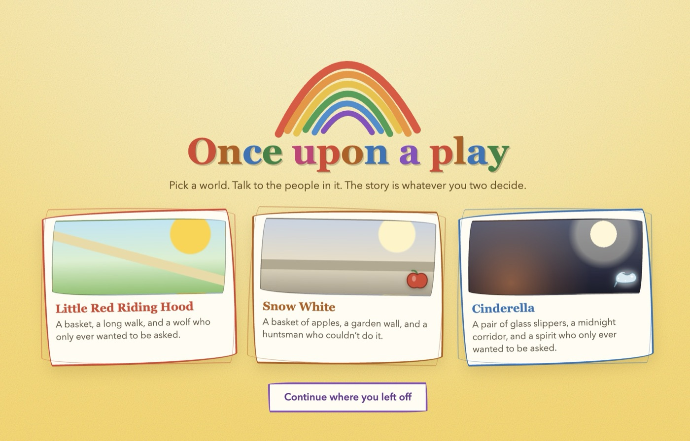
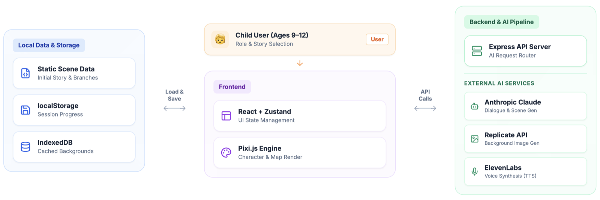
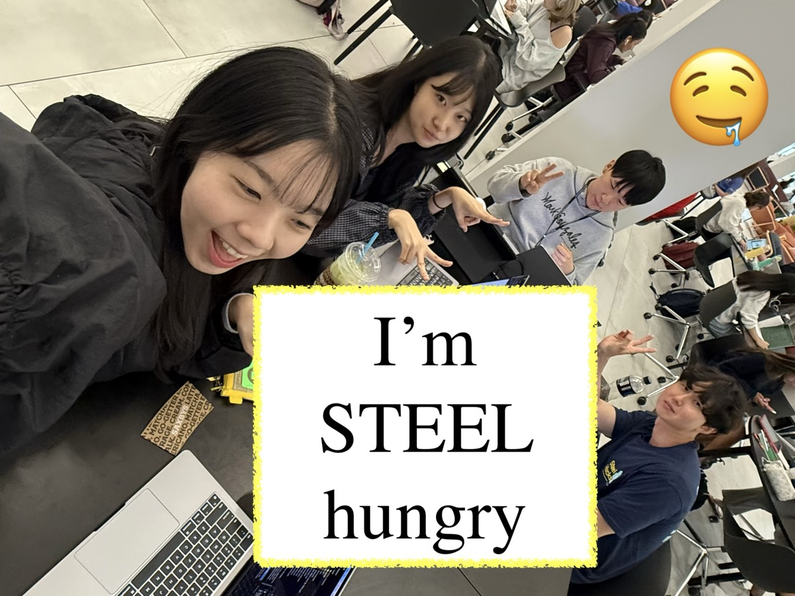

# Once upon a play

**Step into a fairy tale and leave your own story behind.**

Built by **Steel Hungry** at **SteelHacks XIII 2026** (University of Pittsburgh, Sep 19–20, 2026).

Once upon a play is an interactive story game for children aged 9–12. Pick a
world, explore an illustrated map, talk to its characters, and make choices
that shape the ending. When a child wants something new, they can just ask
for it — the story keeps generating.

<p align="center">
  
</p>

## Why we built this

> "Kids aren't hungry for books anymore... Kids are losing their creativity
> because of AI." — the fear we kept hearing.

We think that's backwards. AI doesn't have to replace a child's creativity —
it can be the tool that gives it somewhere to go. A kid who won't finish a
book will finish a story here, because it's theirs: they're not reading it,
they're authoring it.

## Try the story

The first playable tale is **Little Red Riding Hood**, an original retelling,
with **Snow White** and **Cinderella** also playable. Play as Red, Gray the
wolf, or a visitor. Talk to the cast, choose a path, and reach one of three
endings.

Features:

- Character dialogue with optional AI replies and scripted demo replies.
- Story choices that change later scenes and the ending.
- **"For the next scene, I want..."** — children describe what happens next
  in their own words, and the story generates a new scene around it.
- Ready-made companions or a character created from a photographed drawing.
- Draggable characters and a layered 2.5D map that pans when you drag the background.
- An illustrated storybook that can be printed or saved as a PDF.
- Progress saved in the current browser so a child can resume later.

The artwork is original placeholder art drawn in code. The drawing scanner
removes light paper in the browser; it does not use an image generation model.

## How it's built

<p align="center">
  
</p>

- **Frontend** — React + Zustand for UI state, Pixi.js for character and map rendering.
- **Local storage** — static scene data, `localStorage` for session progress, IndexedDB for cached backgrounds.
- **Backend & AI pipeline** — an Express API routes requests to Anthropic Claude for dialogue and scene generation, the Replicate API for background image generation, and ElevenLabs for text-to-speech.

## Run locally

Requires Node.js 24 and npm.

```bash
npm ci
npm run dev
```

Open `http://localhost:5173`. Vite serves the client on port 5173 and proxies
`/api` to the Express server on port 8787. No API key is needed for the scripted
demo. For AI dialogue, copy `.env.example` to `.env` and set
`ANTHROPIC_API_KEY`. The key stays on the server and is excluded from Git.

To test the production setup locally:

```bash
npm run build
npm start
```

The built client and API are then served from `http://localhost:8787`.

## Deploy and share

The client and API need to deploy together. `vercel.json` configures the Vite
build, while `api/chat.ts` and `api/health.ts` expose the Express API as Vercel
Functions on the same HTTPS origin.

1. Push this project to a GitHub repository. `.gitignore` excludes the API key,
   dependencies, build output, logs, and project reference PDFs.
2. In Vercel, select **Add New → Project**, import the repository, and deploy.
   The Vite framework, build command, and output directory are set in
   `vercel.json`.
3. Confirm `/api/health` returns `{"ok":true,...}`, then share the generated
   `https://…vercel.app` URL.

The deployed demo uses scripted replies unless `ANTHROPIC_API_KEY` is added as
a **secret environment variable in Vercel**. Do not add the key to the repository.
With an API key, each function instance applies a basic limit of 30 requests
per IP per hour. A wider release needs a shared rate limiter and authentication.

Production chat logs are disabled by default. Story progress and scanned
drawings are stored in each visitor's browser, not a shared account.

## Project structure

| Path | Purpose |
| --- | --- |
| `src/content/` | Tale scenes, branches, character profiles, and dialogue rules |
| `src/pixi/` | Illustrated maps, sprite animation, parallax, and drawing scan |
| `src/state/` | Story progress, choices, characters, and local saves |
| `src/ui/` | Map selection, conversations, scanner, ending, and storybook |
| `server/` | Express API, AI integration, scripted replies, and safety filters |
| `api/` | Vercel Function entry points for chat and health |
| `vercel.json` | Vercel build and function configuration |

Authored choices move the story between scenes and set flags. AI-generated
conversation suggestions can only say a line; they cannot change the plot.
Incoming and outgoing dialogue passes through the safety filters in
`server/safety.ts`.

Children can also type an idea into **What happens next?**. With `ANTHROPIC_API_KEY`,
Claude writes a new scene and selects from 35 prebuilt SVG backdrops and
54 props. It can combine them, place the current characters, and give
props short interactions. For example, a space backdrop can contain a laptop
for a hackathon story. The server checks all asset IDs, coordinates, and
character IDs before rendering. Tap a prop to add its discovery to the story,
or tap the exit arrow to continue. The scene's narration enters the story log
and future scene requests. No image generation API or image key is needed.
Children can drag a prop to move it. Selecting a prop shows a frame whose
lower-right handle changes its size, plus a small panel with its name and
Delete. Tapping outside the prop closes the panel. **Next scene** in the upper
right asks for the next scene. Prop placement, size, and deletion are saved locally.
Without `ANTHROPIC_API_KEY`, the game records the child's idea in a simple demo
scene. Older saved maps made with the tile or generated-image approach still
display when resumed.

The **Listen to this scene** button reads the visible scene using ElevenLabs
Text to Speech. Add `ELEVENLABS_API_KEY` to the local `.env` file; optionally set
`ELEVENLABS_VOICE_ID` to a voice from your ElevenLabs account. The server keeps
the key private and returns MP3 audio to the browser. Listening can be stopped,
and replaying the same scene in one page session reuses the generated audio.
English scene narration uses the storyteller voice, while attributed dialogue
uses the matching character voice. Voice IDs can be overridden with the
`ELEVENLABS_RED_VOICE_ID`, `ELEVENLABS_WOLF_VOICE_ID`, and
`ELEVENLABS_GRANDMA_VOICE_ID` variables. Unattributed dialogue stays with the
storyteller voice.

## Check the build

```bash
npm test
npm run build
```

This is a playable prototype. It currently includes three tales and code-drawn
art. Full 3D worlds, shared accounts, and a parent dashboard are not part of
this build.

## What we learned

- **Exploration first.** Kids build stories best when they're exploring a
  scene, not staring at a blank text box.
- **Zero latency.** Even a few seconds of waiting kills the magic — instant
  feedback is what keeps a child in the story.

## Team — Steel Hungry

<p align="center">
  
</p>

Chiyoung Kim · Sumin Shim · Doyoung Heo · Seungyeon Back

Built in 24 hours at **SteelHacks XIII**, University of Pittsburgh — September 19–20, 2026.
